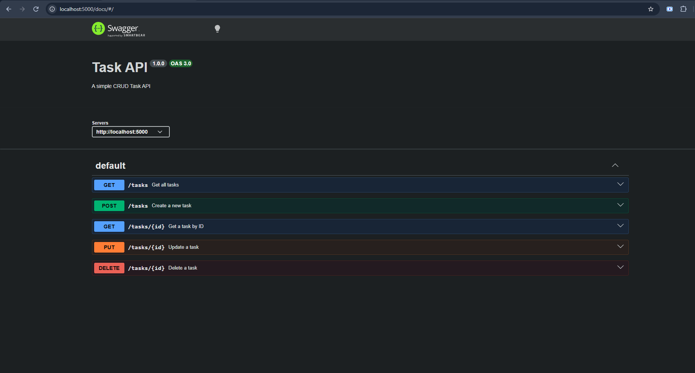

# Task API

A simple in-memory CRUD REST API built with Node.js and Express.js.

## Features

* Create a task
* Get all tasks
* Get a task by ID
* Update a task
* Delete a task
* Swagger API documentation
* Input validation
* In-memory data storage

## Technologies

* Node.js
* Express.js
* Swagger UI Express

## Installation

Clone the repository:

```bash
git clone YOUR_GITHUB_REPOSITORY_URL
```

Go to the project directory:

```bash
cd task_api
```

Install dependencies:

```bash
npm install
```

Start the server:

```bash
node server.js
```

The API will run at:

```text
http://localhost:5000
```

## API Endpoints

| Method | Endpoint     | Description           |
| ------ | ------------ | --------------------- |
| GET    | `/`          | API information       |
| GET    | `/health`    | Health check          |
| GET    | `/tasks`     | Get all tasks         |
| GET    | `/tasks/:id` | Get task by ID        |
| POST   | `/tasks`     | Create a task         |
| PUT    | `/tasks/:id` | Update a task         |
| DELETE | `/tasks/:id` | Delete a task         |
| GET    | `/docs`      | Swagger documentation |

## Example Request

### Create a task

```json
{
  "title": "Buy milk"
}
```

### Example Response

```json
{
  "id": 4,
  "title": "Buy milk",
  "done": false
}
```

## Status Codes

* `200` — Successful request
* `201` — Task created
* `204` — Task deleted
* `400` — Invalid request
* `404` — Task not found

## API Test
```text
HTTP/1.1 200 OK
X-Powered-By: Express
Content-Type: application/json; charset=utf-8
Content-Length: 139
ETag: W/"8b-LGojVkqvSd4NeKWzNkpPYplbVlA"
Date: Fri, 25 Sep 2026 04:07:43 GMT
Connection: keep-alive
Keep-Alive: timeout=5

[
  {
    "id":1,
    "title":"Learn Node.js",
    "done":false
  },
  {
    "id":2,
    "title":"Build Task API","done":false
  },
  {
    "id":3,
    "title":"Learn Swagger","done":true
  }
]
```
## Swagger Documentation

Swagger UI is available at:

```text
http://localhost:5000/docs
```


## Note

This project uses in-memory storage, so tasks are reset whenever the server restarts.
