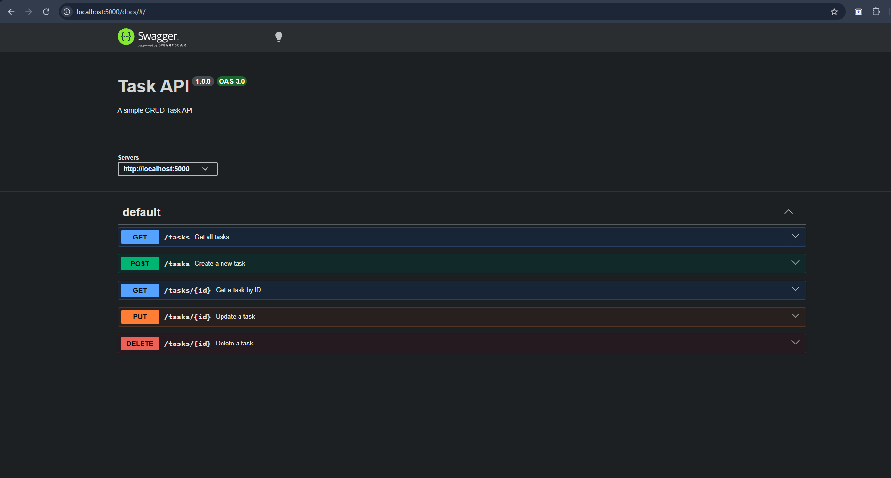

# Task API

A beginner-friendly CRUD REST API for tasks, built with Node.js, Express, and SQLite. You can create, list, retrieve, update, and delete tasks through the API.

Each task has an automatically generated `id`, a `title`, and a `done` status.

## Why SQLite?

SQLite is a good fit for this project because it:

- Stores the database in a single file.
- Requires minimal setup.
- Does not need a separate database server.
- Keeps task data when the application restarts.

## Database setup

The database file is `tasks.db` in the project directory. When the application starts, it automatically creates the file if it does not exist and creates the `tasks` table if needed.

The application inserts three example tasks only when the `tasks` table is empty. Restarting the server does not insert duplicate seed tasks.

## Installation

From the project directory, install the dependencies:

```bash
npm install
```

## Start the server

```bash
node server.js
```

The API runs at `http://localhost:5000`.

## API endpoints

| Method | Endpoint | Description |
| --- | --- | --- |
| GET | `/tasks` | Get all tasks |
| GET | `/tasks/:id` | Get one task by ID |
| POST | `/tasks` | Create a task |
| PUT | `/tasks/:id` | Update a task |
| DELETE | `/tasks/:id` | Delete a task |

### Create a task

Send a JSON body with a non-empty title:

```json
{
  "title": "Buy milk"
}
```

A successful create returns the task, including its database-generated ID:

```json
{
  "id": 4,
  "title": "Buy milk",
  "done": false
}
```

## Example SQL query

The update endpoint uses a parameterized SQL query:

```sql
UPDATE tasks SET title = ?, done = ? WHERE id = ?
```

The `?` placeholders are bound to the new title, completion status, and task ID. This updates only the task with the specified ID without inserting user-provided values directly into the SQL statement.

## API documentation

Swagger UI is available at `http://localhost:5000/docs`.



## Database screenshot

_Placeholder: add a screenshot of the `tasks` table opened in DB Browser for SQLite when available._
